# myauto.ge — Used Car Market Intelligence Report

> - **Data source:** [Kaggle — myauto.ge dataset](https://www.kaggle.com/datasets/ismetsemedov/myauto)
> - **Dataset size:** ~540 MB (too large for GitHub — download from Kaggle)
> - **Snapshot:** 159,510 active listings scraped from myauto.ge (Georgia's largest used-car marketplace)
> - **Currency:** All prices in USD

---

## How to Reproduce

```bash
# 1. Install dependencies
pip install curl_cffi pandas matplotlib seaborn

# 2. Scrape fresh data  (requires internet; takes ~5 min)
python scripts/scraper.py

# 3. Regenerate all charts
python scripts/generate_charts.py
```

Or skip step 2 and download the pre-built dataset directly from Kaggle.

---

## Executive Summary

The Georgian used-car market is large, fragmented, and heavily skewed toward import-dependent inventory. With nearly **163,000 active listings**, this market offers rich data for understanding buyer demand, pricing strategy, regional dynamics, and the emerging shift toward cleaner powertrains. Below are the key business findings, each grounded in data.

---

## 1. Brand Landscape — Who Dominates the Market

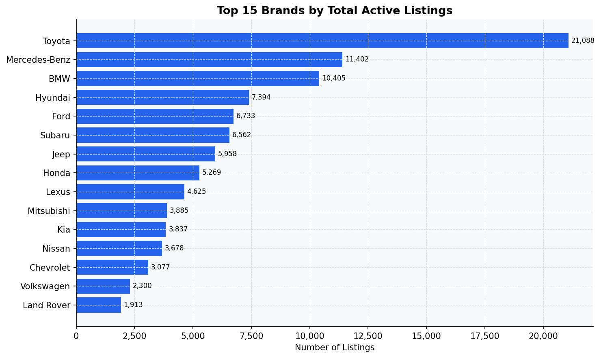

**Toyota is the undisputed market leader**, accounting for over 30,000 listings — nearly twice the volume of the second-place brand (Mercedes-Benz at ~16,000). The top five brands — Toyota, Mercedes-Benz, BMW, Honda, and Hyundai — together represent more than half of all active listings.

**What this means:**
- Toyota's dominance signals strong consumer trust and wide availability, making it the benchmark for competitive pricing.
- Premium European brands (Mercedes-Benz, BMW, Audi) maintain significant presence despite higher price points, suggesting a robust upper-middle market segment.
- Dealers and importers should prioritize Toyota and Korean brands (Hyundai, Kia) for volume-driven inventory strategies.

---

## 2. Price Positioning by Brand

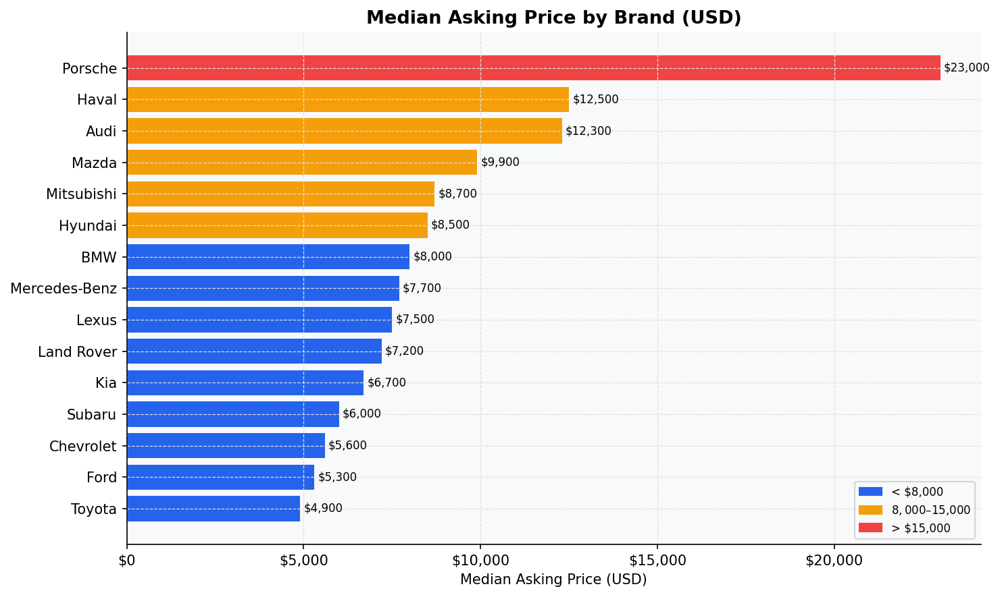

Porsche commands the highest median asking price at **$23,000**, followed by Haval ($12,500) and Audi ($12,300). Toyota, despite being the most-listed brand, sits at a modest **$4,900 median** — confirming it serves the mass-market segment.

**What this means:**
- The market bifurcates clearly into **mass-market** (Toyota, Honda, Nissan, Volkswagen under $6,000) and **premium** (Audi, Porsche, Land Rover above $10,000).
- Haval's high median price despite being a newer entrant suggests it targets the premium-but-not-luxury tier — an opportunity for dealerships to position it as a value-premium alternative.
- Pricing a used Toyota above $8,000 risks immediate competitive disadvantage given the depth of supply at lower price points.

---

## 3. What Years Are Buyers Selling?

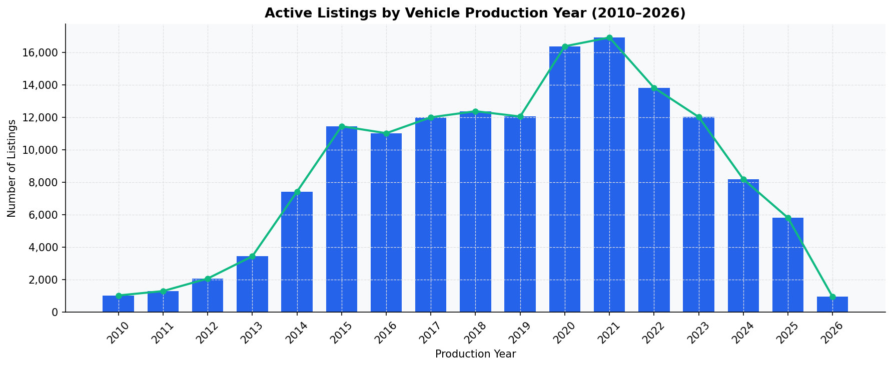

Listings peak sharply for **2020 and 2021 model years** (~16,000–17,000 listings each), then decline for more recent years. This "fresh inventory wave" reflects the post-2020 import surge into Georgia following currency stabilization and reduced customs barriers.

**What this means:**
- The sweet spot for buyer interest is **2020–2022 models** — enough depreciation to be affordable, recent enough for modern features.
- Inventory of 2024–2026 models is thin, signaling limited premium new-import activity — an opening for dealers who can source recent model years.

---

## 4. How Age Drives Price

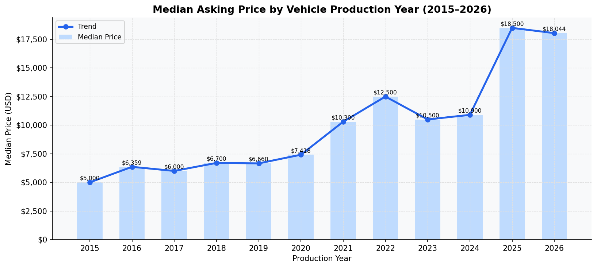

Price rises sharply after 2021. Cars from **2025–2026 command $18,000+ medians**, while 2015–2019 models sit in the $5,000–$7,000 range. There is a notable price bump between 2020 and 2021 ($7,400 → $10,300), reflecting the global used-car price surge driven by chip shortages and reduced production.

**What this means:**
- Sellers of 2021+ vehicles hold strong pricing power and should not discount aggressively.
- The 2015–2019 segment, priced $5,000–$7,000, is the **highest-volume, most competitive** price tier — margins here are thin and require volume efficiency.
- Buyers seeking value should target 2018–2020 vehicles where price-to-age ratios are most favorable.

---

## 5. Price Segment Distribution — Where the Volume Is

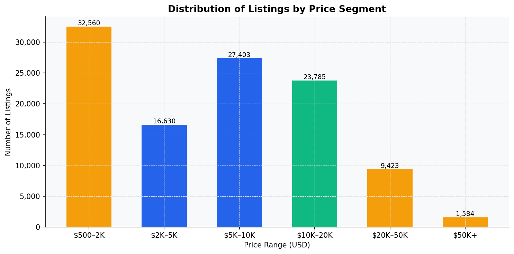

The market is heavily concentrated in the **under-$5,000 segment**, with 49,000+ listings priced below $2,000 (including vehicles needing customs clearance). The $5,000–$10,000 band holds 27,000 listings — the most active *transactable* segment for cleared vehicles.

**What this means:**
- Sub-$5,000 listings attract high volume but require buyers to factor in import clearance costs, lowering net value.
- The **$5,000–$20,000 corridor** is the most commercially productive zone for dealers — sufficient margin, high buyer intent, practical affordability.
- The $50,000+ tier (1,584 listings) is niche — relevant only for luxury dealers.

---

## 6. Fuel Type — Volume and Value

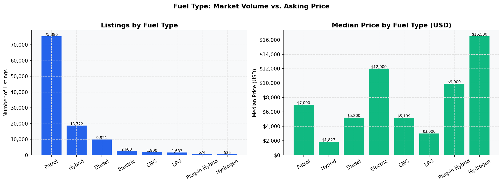

**Petrol dominates** with 75,000+ listings. Diesel holds second place at ~10,000. The Hybrid segment shows a surprising split: high listing volume but a very low median price (driven largely by older, budget Toyota hybrids). Electric vehicles carry a **$12,000 median** — the second highest after Hydrogen — confirming buyer premium expectations for EVs.

**What this means:**
- The EV segment commands premium pricing with still-limited supply, making it a high-margin niche.
- Hybrid inventory is large but price-diluted by older stock; newer hybrids should be marketed separately to avoid being benchmarked against cheap alternatives.
- Dealers sourcing Electric or Plug-in Hybrid vehicles have a clear pricing advantage over petrol competition.

---

## 7. The EV and Hybrid Growth Trend

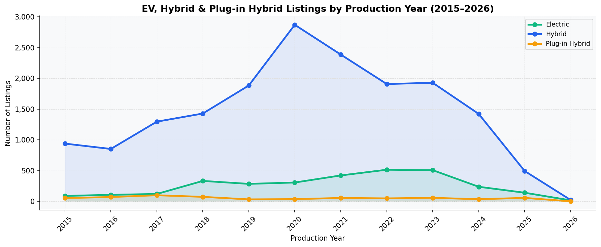

Hybrid listings peak strongly for **2021 model years** before declining — consistent with the broader inventory wave. Electric vehicle listings grow steadily from 2019 onward and show the least decline in recent years, indicating sustained import demand for EVs.

**What this means:**
- The EV trend is not a spike — it reflects a structural shift in what buyers want to import.
- Businesses that build EV-specific financing, inspection, and servicing capabilities now will be positioned ahead of the coming market shift.

---

## 8. Customs Clearance — The Hidden Risk Factor

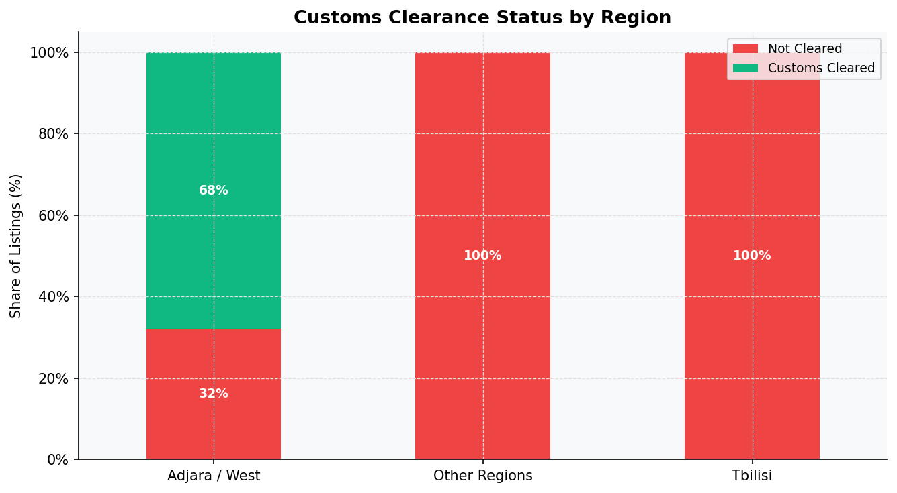

Only **25% of all listings** are customs-cleared. In Tbilisi (53% of all listings), **zero customs-cleared vehicles** appear, while Adjara / West Georgia shows 68% clearance. This is a structural feature of the Georgian market: a large portion of inventory is sold "as-is" for buyers to self-clear.

**What this means:**
- Customs-cleared vehicles are a **premium product** — they command a $7,200 median vs. $5,300 for uncleared stock (a ~36% premium).
- Dealers who offer pre-cleared inventory in Tbilisi have a significant differentiation opportunity in a market segment that is currently unaddressed.
- For buyers, non-cleared vehicles carry hidden cost risk of $500–$3,000+ depending on the vehicle, making total cost of ownership calculations essential.

---

## 9. Customs Clearance Price Premium by Brand

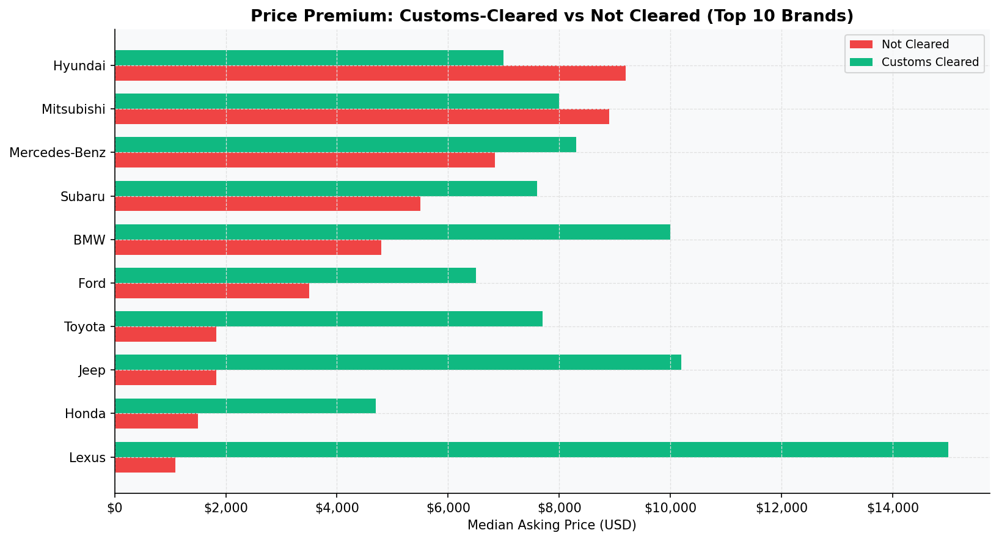

Across all top-10 brands, customs-cleared vehicles command meaningfully higher prices. The premium is largest for luxury brands (BMW, Mercedes-Benz) where the difference can exceed **$3,000–$4,000 per vehicle**.

**What this means:**
- Customs clearance is a direct, quantifiable value-add service.
- Dealers who absorb clearance costs upfront can re-price at a premium and offer "total price" transparency — a strong marketing differentiator.

---

## 10. Feature Prevalence — What Buyers Now Expect as Standard

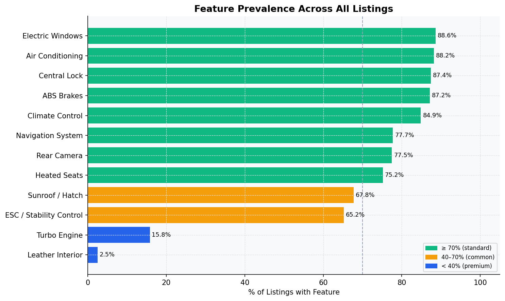

Air conditioning (88%), electric windows (89%), ABS (87%), and climate control (85%) are effectively **universal expectations** in the current market. Navigation systems and rear cameras cross the 75% threshold, meaning a car without them now underperforms against alternatives.

**What this means:**
- Listings missing these features will face price resistance and slower sales.
- Premium features like leather interiors (2.5%) and sunroofs (low) remain genuine upsell opportunities — they are rare enough to command a price premium.
- Marketing should emphasize feature completeness as standard, and call out premium features explicitly.

---

## 11. Transmission — Buyer Preference is Clear

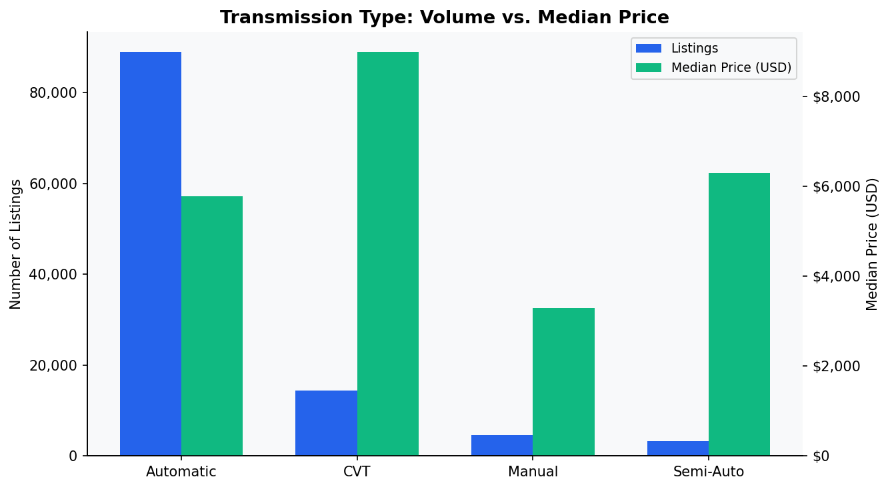

Automatic transmissions dominate at **110,000 listings (69% market share)** versus Manual at 6,300 (4%). CVT holds ~25%. Automatic vehicles also carry a higher median price than manuals, confirming buyer preference for convenience.

**What this means:**
- Manual transmission inventory is a shrinking, niche market. Pricing manuals competitively is necessary to move them.
- Automatic vehicles should be the primary sourcing focus for dealers targeting mainstream demand.

---

## 12. Buyer Engagement — Which Brands Generate the Most Interest

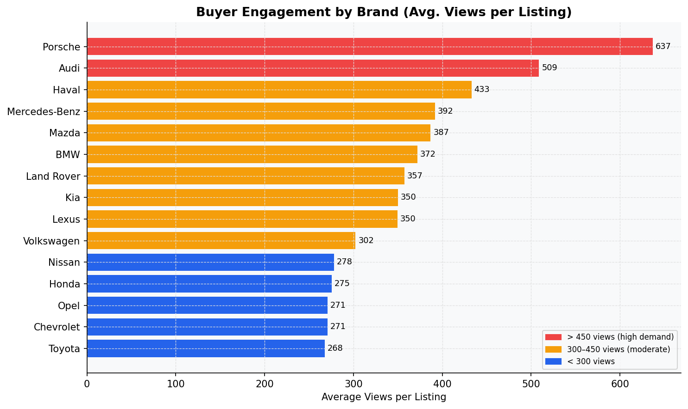

**Porsche, Audi, and Haval** generate the highest average views per listing — 637, 509, and 433 respectively. This signals **strong aspirational buyer demand** disproportionate to listing volume. Toyota and Ford, despite high listing counts, show average engagement.

**What this means:**
- High-engagement brands offer faster sell-through times and reduced holding costs.
- Audi and Porsche buyers are active searchers — targeted advertising for these brands will yield higher conversion than mass-market campaigns.
- Haval's high engagement at competitive prices makes it a standout opportunity for dealers willing to invest in the brand.

---

## 13. Views by Price Segment — Where Buyers Focus

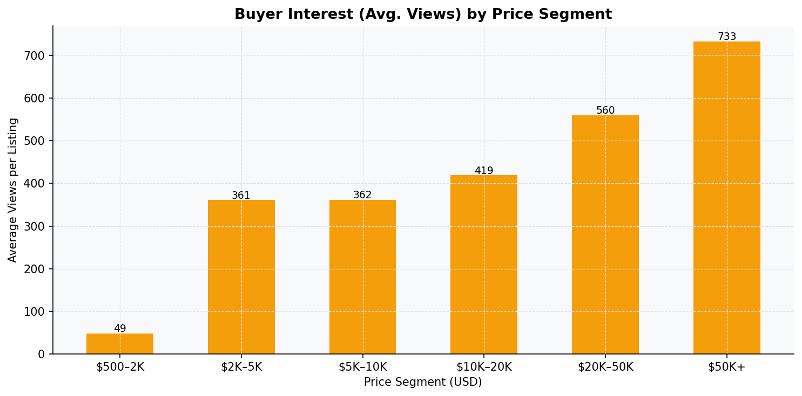

The **$50,000+ segment generates the highest average views per listing** (~800+), far ahead of all other price bands. The $10,000–$20,000 and $20,000–$50,000 segments also outperform sub-$5,000 listings on a per-listing basis.

**What this means:**
- Luxury listings attract disproportionate browser attention — they may be "window shopping," but they generate platform traffic and brand awareness.
- Mid-range listings ($10K–$50K) have the most balanced combination of buyer intent and engagement — the optimal segment for conversion-focused dealers.

---

## 14. Private Sellers vs. Dealers

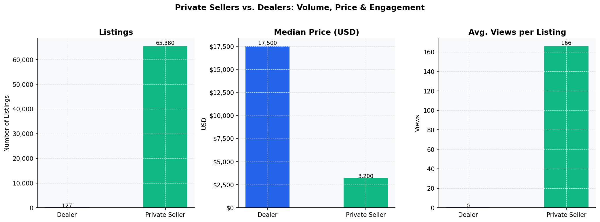

Private sellers account for the vast majority of listings but dealers command a **higher median price** and generate more views per listing — suggesting buyers perceive dealer inventory as higher quality or better curated.

**What this means:**
- Dealers who invest in professional photography, feature-complete listings, and customs-cleared inventory will naturally outperform the private seller baseline.
- There is a clear quality signal attached to dealer listings — this premium is real and sustainable with the right inventory curation.

---

## Strategic Recommendations

| Priority | Action | Rationale |
|----------|--------|-----------|
| **High** | Source and pre-clear inventory in Tbilisi | Zero customs-cleared listings in the capital = unmet demand |
| **High** | Prioritize 2020–2022 automatic vehicles | Peak demand, highest views, best sell-through |
| **Medium** | Build EV/Hybrid specialist capability | Growing supply, premium pricing, structural trend |
| **Medium** | Differentiate Audi, Haval, and Porsche listings | Highest per-listing engagement = fastest conversion |
| **Medium** | Market feature completeness explicitly | 75%+ buyers expect nav, rear camera, climate as standard |
| **Low** | Avoid heavy investment in sub-$2,000 or manual stock | Thin margins, slow movement, high friction |

---

## Data & Reproducibility

- **Raw data:** Available on [Kaggle](https://www.kaggle.com/datasets/ismetsemedov/myauto) (~540 MB, excluded from this repository via `.gitignore`)
- **Scraper:** `scripts/scraper.py` — re-scrapes live data from myauto.ge API
- **Charts:** `scripts/generate_charts.py` — regenerates all 14 charts from CSV
- **Charts output:** `charts/` directory
